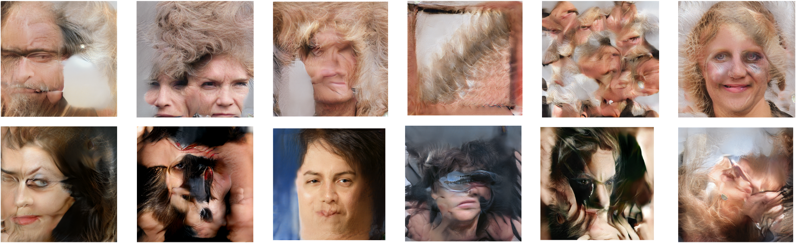

# Manipulated Network: Sketchbook  
###### Coding Two: Advanced Frameworks    
Jasper Zheng (Shuoyang) / 21009460  

[Full Git Repository](https://github.com/jasper-zheng/manipulated-network-sketchbook)   


**'Manipulated Network: Sketchbook'** collects images generated by human-disrupted [StyleGAN](https://github.com/NVlabs/stylegan) models. These models are manipulated in different methods: [Intermediate Latent Space Truncation](https://arxiv.org/abs/2202.05910), weight matrices manipulation and [Network Bending](https://github.com/terrybroad/network-bending).  

The sketchbook is available at:   
[Full Resolution (14.2MB)](https://github.com/jasper-zheng/manipulated-network-sketchbook/blob/main/Manipulated_Network_Sketchbook_Jasper_Zheng.pdf)  
[Compressed (2.7MB)](https://github.com/jasper-zheng/manipulated-network-sketchbook/blob/main/Manipulated_Network_Sketchbook_s_Jasper_Zheng.pdf).   
It includes subsequent images with descriptive configurations that could recreate the manipulated model.  

  


https://user-images.githubusercontent.com/74963879/158942302-2d84e54d-36fe-4da7-b656-cf30a3d16412.mp4


## Motivation  

My previous project on [Manipulated Network](https://github.com/jasper-zheng/manipulated-network) implemented a set of basic Network Bending operations to a StyleGAN model. During the implementation process, I've come across plenty of quirks and oddities generated from corrupted models. These models produce impossible, distorted but realistic images, diverted from the original outputs and sometimes lead to aesthetic preoccupation. Although utilising machine autonomous, creating this collection is still like a craft: I marked configurations that cause these semantically meaningful results, revisited, tweaked and built the operation template again, and then re-examined the subsequent images. The decisions can be either arbitrary or intentional, sometimes deliberate, all in order to create potentially aesthetic results.  

During this process, I see the generative model as a tool, more like a pen or a camera operating according to human instructions.   

Therefore, I hope to use a sketchbook as a medium to house these cooperated images.  

## Implementation  

Detailed implementation explained in my [Network Manipulation](https://github.com/jasper-zheng/manipulated-network) project.  

In the file `NetworkOperations.py`, 14 basic operations were implemented in the 'Block' class, which could be inserted after specific model layers. The modified StyleGAN model takes a dictionary variable as an operation plan.

`resolution` and `install_after` together define the Conv layer that is going to be operated. In the StyleGAN architecture, each resolution has two convolutional layers, `Conv0_up` is the one that scale up the feature maps, `Conv1` is the accompanied layer after the upscaling layer.  

`layers` defines a list of bending operations that is going to be inserted.  

`operation` takes a string defining the type of operation, including `scale`, `invert`, `shuffle`, `brightness`, `translate`, `vanish`, `mean_filter`, `rotate`, `sharpen`, `erosion`, `dilation`, `mirrorY`, `sin_disrupt`.

An example operation template:  
```
operations = [{'resolution':4,
               'install_after':'Conv0_up',
               'layers':[{'operation':'none',
                           'name':'002',
                           'clusters':[]}]
               },
              {'resolution':4,
                'install_after':'Conv1',
                'layers':[{'operation':'none',
                           'name':'002',
                           'clusters':[]}]
               },
              {'resolution':8,
                'install_after':'Conv0_up',
                'layers':[{'operation':'none',
                           'name':'002',
                           'clusters':[]}]
               },
              {'resolution':8,
                'install_after':'Conv1',
                'layers':[{'operation':'none',
                           'name':'002',
                           'clusters':[]}]
               },
              {'resolution':16,
                'install_after':'Conv0_up',
                'layers':[{'operation':'scale',
                           'name':'001',
                           'scale':-3,
                           'clusters':[0,7]},
                          {'operation':'mean_filter',
                           'name':'002',
                           'kernel_size':3,
                           'clusters':[1,5,6]}]
               },
              {'resolution':16,
                'install_after':'Conv1',
                'layers':[{'operation':'sharpen',
                          'name':'003',
                          'sharpen_factor':5,
                          'with_norm':True,
                          'clusters':[]}]
               },
              {'resolution':32,
                'install_after':'Conv0_up',
                'layers':[]
               },
              {'resolution':32,
                'install_after':'Conv1',
                'layers':[]
               },
              ]
```

## Reflection  

While delicate programs autonomously produce artworks, human elements can quickly be hidden by algorithmic processes. Therefore, I see Manipulated Network as an artistic technique to emphasise human elements in artworks created by generative models, expose individual variability, and find balances between machine autonomy and human creativity.  

## References  


T. Broad, F. Leymarie and M. Grierson, "Network Bending: Expressive Manipulation of Deep Generative Models", arXiv.org, 2022. [Online]. Available: https://arxiv.org/abs/2005.12420. [Accessed: 18- Mar- 2022].

T. Karras, S. Laine and T. Aila, "A Style-Based Generator Architecture for Generative Adversarial Networks", arXiv.org, 2022. [Online]. Available: https://arxiv.org/abs/1812.04948. [Accessed: 18- Mar- 2022].  

D. Bau, S. Liu, T. Wang, J. Zhu and A. Torralba, "Rewriting a Deep Generative Model", arXiv.org, 2022. [Online]. Available: https://arxiv.org/abs/2007.15646. [Accessed: 18- Mar- 2022].  

O. Katzir, V. Perepelook, D. Lischinski and D. Cohen-Or, "Multi-level Latent Space Structuring for Generative Control", arXiv.org, 2022. [Online]. Available: https://arxiv.org/abs/2202.05910. [Accessed: 18- Mar- 2022].  


K. Simonyan and A. Zisserman, "Very Deep Convolutional Networks for Large-Scale Image Recognition", arXiv.org, 2022. [Online]. Available: https://arxiv.org/abs/1409.1556. [Accessed: 18- Mar- 2022].  

Y. Shen, J. Gu, X. Tang and B. Zhou, "Interpreting the Latent Space of GANs for Semantic Face Editing", arXiv.org, 2022. [Online]. Available: https://arxiv.org/abs/1907.10786. [Accessed: 18- Mar- 2022].  

I. Alhashim and T. Andrey, "StyleGAN-Tensorflow2: StyleGAN - TensorFlow 2.0 implementation", GitHub, 2022. [Online]. Available: https://github.com/ialhashim/StyleGAN-Tensorflow2. [Accessed: 18- Mar- 2022].    
