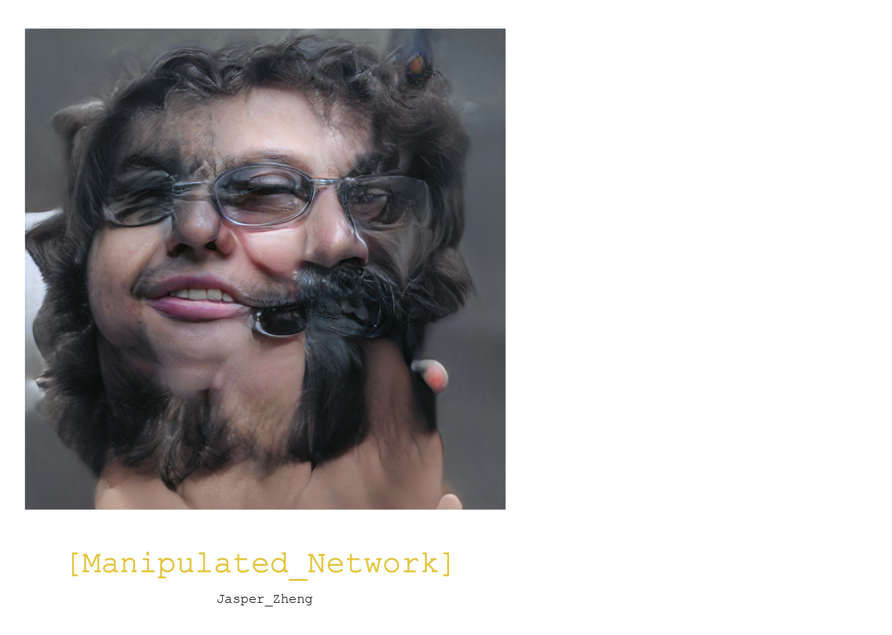

# Manipulated Network: Sketchbook  
###### Coding Two: Advanced Frameworks    
Jasper Zheng (Shuoyang) / 21009460  

[Full Git Repository](https://github.com/jasper-zheng/manipulated-network-sketchbook)   

'Manipulated Network: Sketchbook' collects images generated by human-disrupted [StyleGAN](https://github.com/NVlabs/stylegan) models. These models are manipulated in different methods: [Intermediate Latent Space Truncation](https://arxiv.org/abs/2202.05910), weight matrices manipulation and [Network Bending](https://github.com/terrybroad/network-bending).  

The sketchbook is available at: [link](https://github.com/jasper-zheng/manipulated-network-sketchbook/blob/main/Manipulated_Network_Sketchbook_Jasper_Zheng.pdf). It includes subsequent images with descriptive configurations that could recreate the manipulated model.

## Motivation  

My previous project on [Manipulated Network](#) implemented a set of basic Network Bending operations to a StyleGAN model. During the implementation process, I've come across plenty of quirks and oddities generated from corrupted models. These models produce impossible, distorted but realistic images, diverted from the original outputs and sometimes lead to aesthetic preoccupation. Although utilising machine autonomous, creating this collection is still like a craft: I marked configurations that cause these semantically meaningful results, revisited, tweaked and built the operation template again, and then re-examined the subsequent images. The decisions can be either arbitrary or intentional, sometimes deliberate, all in order to create potentially aesthetic results.  

During this process, I see the generative model as a tool, more like a pen or a camera operating according to human instructions.   

Therefore, I hope to use a sketchbook as a medium to house these cooperated images.  

## Implementation  
